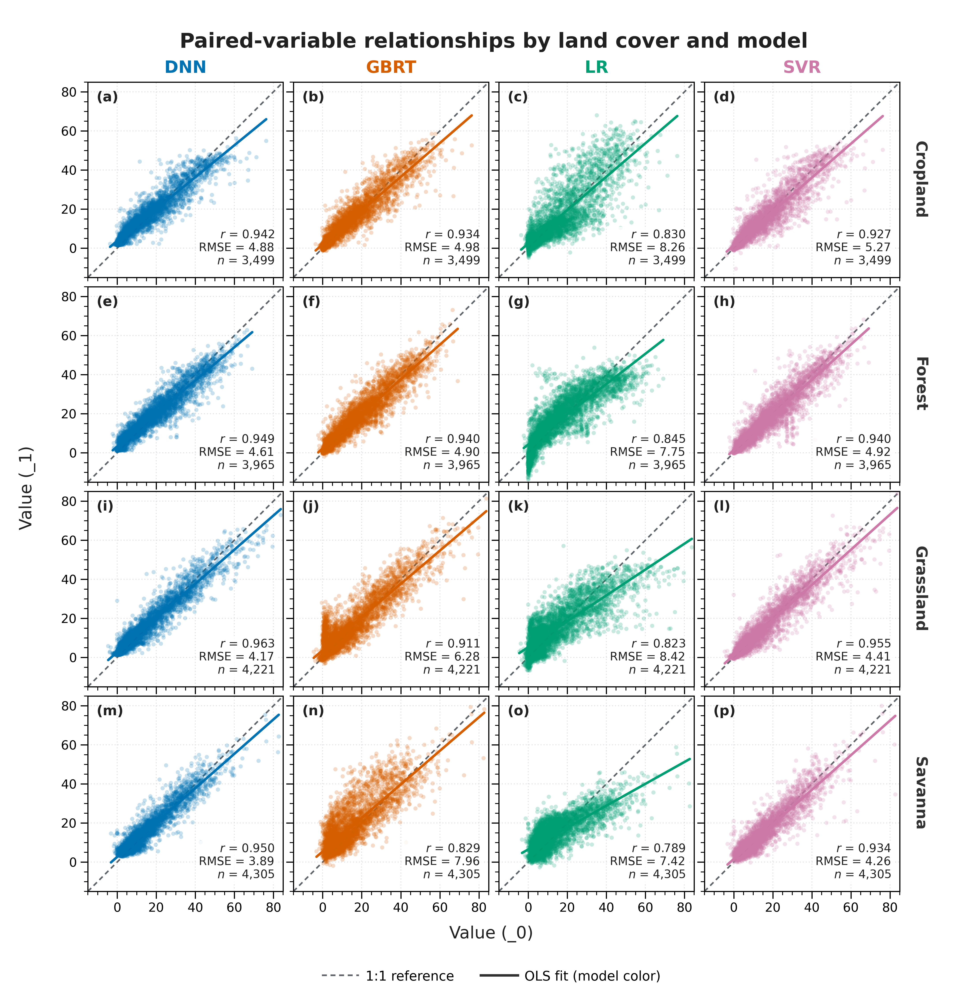

**English** | [简体中文](README_zh.md)

# UltraPlot Skill A/B Test: Correlation Scatter Plot

## Experiment provenance

- The four overall plotting conditions in this replacement run were produced by
  independent agents launched with `fork_turns="none"`; they did not inherit
  prior conversation turns. This provides content-level isolation.
- All conditions still shared one host and filesystem. There was no operating-
  system-level access isolation or low-level file-access audit, so the run was
  neither OS-hermetic nor fully blind.
- The skill-disabled condition did not open the skill instructions or supporting
  skill files. The system skill catalog and its short description remained
  visible, so this does not establish that the agent could not know the skill
  existed.
- The skill-enabled condition used `ultraplot-figures` v1.3.0. It did not read
  any existing example results or prior skill test results.
- The skill-enabled condition used the operational UltraPlot MCP. The MCP
  `ultraplot.subplots` source matched the selected `spyder_env` UltraPlot 2.7.0
  runtime, and task-relevant lookups inspected `PlotAxes.scatter` and
  `Figure.supxlabel`. The skill-disabled condition did not use UltraPlot MCP.
- There is no evidence that a condition read existing test results or another
  condition's outputs. Cross-condition comparison began only after all four
  condition results were frozen.
- During repository integration, only the input path, output directory, and
  repository output basenames were adapted. Both correlation designs were then
  rerun unchanged against the same workbook.

These controls support a content-isolated comparison, but not a claim of a
fully sealed or provably blind experiment.

## Input data

- Workbook: [multiple_data.xlsx](data/multiple_data.xlsx)
- Worksheet and shape: `Sheet1`, 4,305 rows × 32 numeric columns
- Structure: four land covers × four models × paired `_0` and `_1` fields
- Land covers: `cropland`, `forest`, `grassland`, `savanna`
- Models: `DNN`, `GBRT`, `LR`, `SVR`
- Complete pairs per land cover: 3,499, 3,965, 4,221, and 4,305;
  63,960 finite pairs across all 16 land-cover/model combinations

## Prompt control

The prompt below records this replacement run. Machine-specific input and skill
paths are shown as repository links; this path normalization does not change the
visible wording or the condition difference.

The common task was:

> Plotting data file: `data/multiple_data.xlsx`
>
> Compare the relationship between `_0` and `_1` under DNN, GBRT, LR, and SVR
> for cropland, forest, grassland, and savanna.
>
> Provide directly runnable Python code and export PDF and PNG.

Only the plotting instruction changed:

| Condition | Plotting instruction |
|---|---|
| Skill enabled | `Use [$ultraplot-figures](https://github.com/lwq-star/ultraplot-figures/blob/v1.3.0/SKILL.md) to create a publication-ready correlation scatter plot.` |
| Skill disabled | `Use UltraPlot to create a publication-ready correlation scatter plot.` |

The figures were regenerated with UltraPlot 2.7.0 and Matplotlib 3.10.6.

## Figure comparison

### Skill enabled

### Skill disabled

## Output files

| Artifact | Skill enabled | Skill disabled |
|---|---|---|
| Analysis and plotting | [correlation_scatter.py](with_skill/correlation_scatter.py) | [correlation_scatter_ultraplot.py](without_skill/correlation_scatter_ultraplot.py) |
| PDF | [correlation_scatter.pdf](with_skill/correlation_scatter.pdf) | [correlation_scatter_ultraplot.pdf](without_skill/correlation_scatter_ultraplot.pdf) |
| PNG | [correlation_scatter.png](with_skill/correlation_scatter.png) | [correlation_scatter_ultraplot.png](without_skill/correlation_scatter_ultraplot.png) |

## Objective output information

| Item | Skill enabled | Skill disabled |
|---|---:|---:|
| PDF pages | 1 | 1 |
| PDF page size | 182.9996 × 179.8458 mm | 186.6900 × 191.7700 mm |
| PNG dimensions | 7,204 × 7,080 px | 4,410 × 4,530 px |
| PNG resolution metadata | 999.998 dpi | 599.999 dpi |
