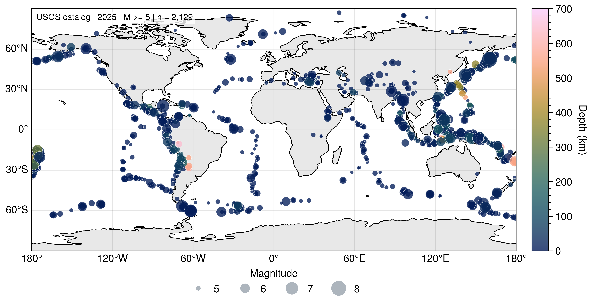
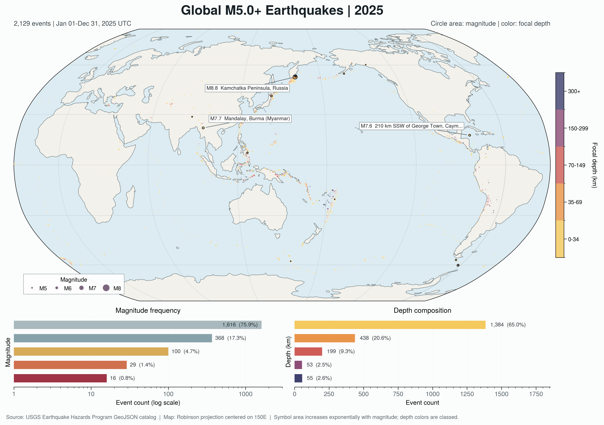

[English](README.md) | **简体中文**

# UltraPlot Skill A/B 测试：2025 年全球 M5+ 地震

## 输入数据

- GeoJSON：[usgs_earthquakes_2025_m5plus.geojson](data/usgs_earthquakes_2025_m5plus.geojson)
- 源要素数：2,129
- 每组实际绘制的有效 Point 要素数：2,129
- 要素类型：2,128 条记录的 `properties.type == "earthquake"`；1 条记录的
  `properties.type == "landslide"`
- 新一轮冻结测试均绘制了所有有效 Point 要素，因此保留了该 landslide 记录；
  仓库集成阶段没有另行过滤
- 震级范围：M5.0-M8.8；深度范围：0-648.298 km

## 提示词控制

以下输入路径使用仓库相对路径，避免公开本机信息。每组的完整有效提示词由对应
的条件指令和共同任务组成。重测时使用的本地 skill 链接在此以等价的 v1.3.0
仓库固定链接表示，提示词的可见文字未改变。

共同任务为：

> 绘图数据文件：`data/usgs_earthquakes_2025_m5plus.geojson`
>
> 图中能够展示 2025 年全球 M5 以上地震的空间分布、震级和深度特征，让读者
> 直观了解这些地震在全球的分布情况及其主要特征。
>
> 请提供可直接运行的 Python 代码，导出 PDF 和 PNG。

只有绘图指令发生变化：

| 条件 | 绘图指令 |
|---|---|
| 使用 skill | `请使用 [$ultraplot-figures](https://github.com/lwq-star/ultraplot-figures/blob/v1.3.0/SKILL.md) 绘图。` |
| 不使用 skill | `请使用 UltraPlot 绘图。` |

本次重测使用 UltraPlot 2.7.0、Matplotlib 3.10.6 和 Cartopy 0.25.0；skill
启用组使用 `ultraplot-figures` v1.3.0。

## 隔离与来源说明

- 生成代理使用 `fork_turns="none"`，没有继承历史对话。提示词内容和生成产物
  在内容及工作流层面相互隔离。
- 代理被明确要求不读取已有测试脚本或图件、另一条件的文件，以及 skill 示例
  中的旧测试结果。目前没有交叉读取的证据。skill 禁用组没有打开 skill 指令
  或支持文件，但系统 skill 目录及其简短说明仍然可见；skill 启用组使用
  v1.3.0，且没有使用旧的 skill 示例结果。
- skill 启用组发现了全部 6 个可用的 UltraPlot MCP 工具；`ping` 返回 `pong`，
  MCP 的 `ultraplot.subplots` 源文件与所选 UltraPlot 2.7.0 `spyder_env` 运行环境
  精确匹配。该组通过 `get_api` 查询了 `PlotAxes.scatter`、`GeoAxes.format` 和
  `Axes.sizelegend`，并使用了 `search_docs` 与 `read_doc`；skill 禁用组未使用
  UltraPlot MCP。
- 两组结果均先冻结，之后才由主流程统一比较。仓库集成阶段仅调整可移植输入
  路径、既有输出 basename/位置，以及不改变图件设计的 Windows `GDAL_DATA`
  初始化，然后重新执行脚本。
- 各代理共享同一主机和文件系统，且没有操作系统级访问隔离或文件访问审计。
  因此这是内容级隔离测试，不是操作系统级密封或完全盲化实验。

## 图件对比

### 使用 `ultraplot-figures`

### 不使用 skill

## 保留文件

| 类型 | 使用 skill | 不使用 skill |
|---|---|---|
| 分析与绘图 | [plot_global_earthquakes.py](with_skill/plot_global_earthquakes.py) | [plot_global_earthquakes_2025.py](without_skill/plot_global_earthquakes_2025.py) |
| PDF | [global_earthquakes_2025_m5plus.pdf](with_skill/global_earthquakes_2025_m5plus.pdf) | [global_earthquakes_2025_m5plus.pdf](without_skill/global_earthquakes_2025_m5plus.pdf) |
| PNG | [global_earthquakes_2025_m5plus.png](with_skill/global_earthquakes_2025_m5plus.png) | [global_earthquakes_2025_m5plus.png](without_skill/global_earthquakes_2025_m5plus.png) |

## 客观输出信息

| 项目 | 使用 skill | 不使用 skill |
|---|---:|---:|
| 实际绘制的有效 Point 要素 | 2,129 | 2,129 |
| PDF 页数 | 1 | 1 |
| PDF 页面尺寸 | 182.9996 x 92.8130 mm | 302.2476 x 212.9183 mm |
| PNG 像素尺寸 | 7,204 x 3,654 px | 3,570 x 2,514 px |
| PNG 分辨率元数据 | 999.998 dpi | 299.999 dpi |
| 显示投影 | Plate Carree，中央经线 0 | Robinson，中央经线 150°E |
